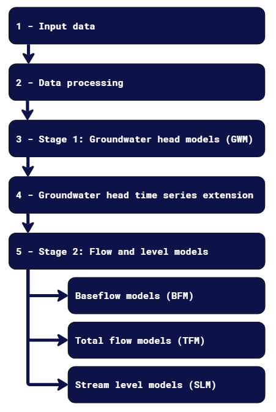

# Data-Driven Modelling for Groundwater-Surface Water Interactions
Master's Thesis by Joaquim Altimiras Granel, Chalmers University of Technology.

2024-06-26

This project contains the files and structure related to the Master's Thesis "Quantifying Groundwater-Surface Water Interactions with Transfer Function Models" by Joaquim Altimiras Granel (2024).

The thesis presents and evaluates a data-driven modelling approach using the Pastas-package in Python 3.11.8. The method is applied to a tunnelling project in Sweden, where leakage to the tunnel risks causing tunnelling-induced drawdown, which can affect the flow in a stream with high ecological values.

The scripts in the repository have been specifically developed for the project, and the input data has been quality controlled before use. The input data in the first folder could not be added to the repository since the data is not open to the public.

Link to the thesis: [to be added, will be found on Chalmers Open Digital Repository at https://odr.chalmers.se/home]



## Recreating the Conda Environment

To recreate the Conda environment used in this project, follow these steps:

1. **Clone the repository**:

    ```bash
    git clone https://github.com/J-AltiGran/hydro_thesis.git
    cd hydro_thesis
    ```

2. **Create the Conda Environment**:

    ```bash
    conda env create -f environment.yml
    ```

3. **Activate the Environment**:

    ```bash
    conda activate masters-thesis
    ```

4. **Verify the Installation**:

    ```bash
    conda list
    ```